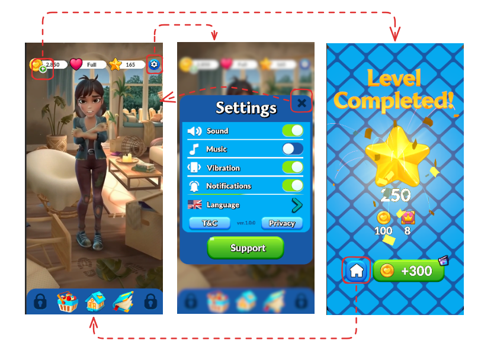

# UITest
The project is to construct UI for testing the development UI system with Unity 6
## Video Demonstration
* The video demonstration is available to view [here](https://youtu.be/wb_heEd8LsU).
## Introduction
<p align="center">
    
</p>

This project consisof three UI panel: the UI for Main screen, Setting enviroment and Level complete. Each UI panel is linked by pressing the specific button which is indicated on the figure.

**Home Screen UI** – The main interface containing navigation elements with bar animation via scripts.

**Settings Popup UI** – A modular settings panel designed for easy expansion supporint localization function.

**Level Completed UI** – A visually dynamic completion screen with animations and effects

The implemented functions are included as the following
* Button pressing animation implemented by scripts.
* UI pop-up animation, transition and blur effect.
* UI management system for ease of maintenance across different screens.
* Localization structured for multi-language adaptation 
* Some vfx, animation and shader for dynamic effect.


## Setup
* This project was developed on Unity version `Unity 6`.
* The scene file is at `Assets/Scenes/UITest.unity`

## Project hierarchy
```commandline
📦Assets
 ┣ 📂Scenes                         // Main Scene
 ┃ ┗ 📜UITest.unity                   
 ┣ 📂Scripts                        // Main scripts for UI and Utility
 ┃ ┣ 📂Core                         // some UI eventtrigger
 ┃ ┣ 📂Localization                 // text localization system
 ┃ ┣ 📂UI                           // UI management, UIPanel and transition animation related scripts
 ┃ ┣ 📂Utility                      // scripts for using in editor to test 
 ┣ 📂Art                            // source from art side, include ui texture, video
 ┣ 📂AssetBoundles                  // assets created in Unity editor, such as prefab, anmiation, etc.
 ┣ 📂Shaders                        // shaders for ui, some special effects
 ┣ 📂Resource                       // resource files, like json file localization
 ┣ 📂Plugins                        // helpfuf asset store sources.
 ┗ ┗ 📂Dotween                      // animation system
 ```

## Future Improvements
* There is no sound system playing the sfx for the UI events
* Currently, window animations are implemented using inheritance from a base WindowUI, which includes foreground and background animations along with feedback. This could be refactored into a component-based system (IComponent), making it easier to maintain and extend.
* All UI elements are instantiated and hidden in the scene by default. Instead, an asynchronous system should be implemented to dynamically instantiate them as needed.
* A GameEvent system is currently missing and should be introduced to improve event handling and communication between UI elements.
* There is no event disregister in the implmented as there is no formal Management to create and destroy UI in order.
* There is no event deregistration in the implementation, as there is no formal management system to properly create and destroy UI elements in right order
There is a loading UI and a gradient UI for the transition and background system, but they are not funtional, only added here as a demonstration of expandability.
* The atlas was generated based on the UI layout, and the original resolution was already quite high. I had to use a 4096 texture size to fit everything in, whereas typically, it should be kept within 2048.

## Reference
* Dotween for GameObject animation

## Thought
1.This is my first time using Cursor, an AI-assisted development tool. It significantly accelerates the realization of ideas—as long as you can clearly describe your requirements and understand the generated code, it truly transforms most programming workflows.However, due to the context-based nature of the tool, there are times when the AI modifies sections that were manually adjusted before, reverting them to its own version. Occasionally, even after repeatedly correcting and refining the output, the code still fails to converge into the desired result, leading to errors during execution.

2.I spent a significant amount of time creating UI prefabs. Initially, since I was provided with a layout file composed from a .psd, I followed a workflow where the .psd was imported into Unity as a .psb file. However, after completing the work, I realized that the .psb files were too large, exceeding the normal upload limits for GitHub.As a result, I had to switch to a different approach—exporting individual images from the .psd and then assembling them into an atlas within Unity. However, the automatic atlas generation feature tends to allocate large image sizes, especially when dealing with background images, as they sometimes don’t fit properly into the atlas.

## Time Spent
The total time for the three UI screens was 2.5 workdays. Just the UI itself, including multiple revisions, took about 1 day. The coding part took roughly 1 day, including writing and debugging, with debugging taking up the majority of the time. Animation, shaders, and VFX took about half a day.
All of this was based on the fact that I hadn’t used Unity for quite a while.